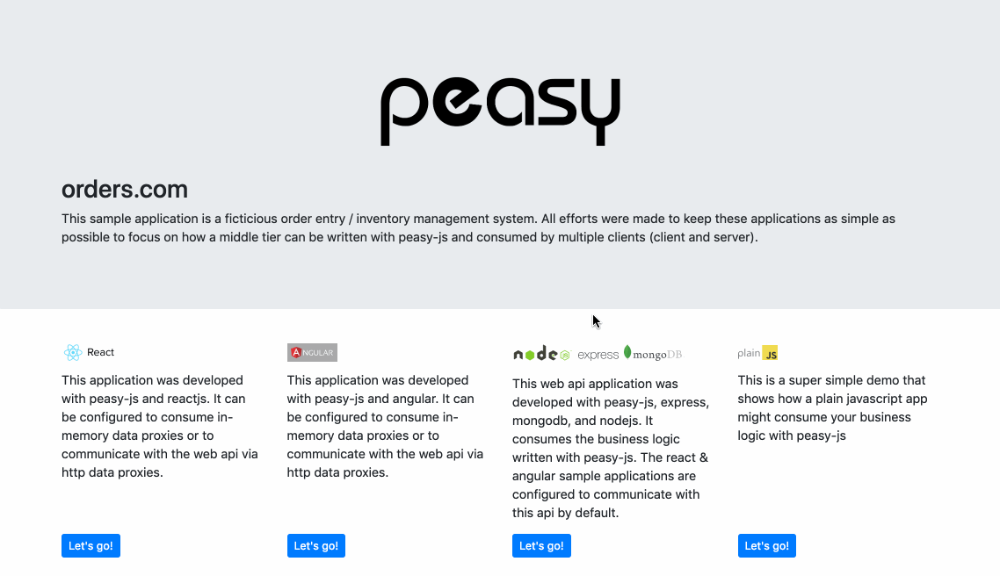
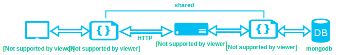

### Showcases business logic built with peasy-js.

This sample application is a ficticious order entry / inventory management system.  All efforts were made to keep this application as simple as possible, with a focus on how business logic can be written with [peasy-js](https://github.com/peasy/peasy-js) and consumed by multiple clients ([react](https://facebook.github.io/react/), [angular](https://angular.io), and [nodejs](https://nodejs.org/en/)).

### Where can I get it?

- Clone the repo: ```git clone https://github.com/peasy/peasy-js-samples.git```
- You can also [download the latest release](https://github.com/peasy/peasy-js-samples/archive/master.zip)

### Requirements

1. [nodejs](https://nodejs.org/) - this application hosts a web api that the client applications rely on and requires node.
2. [postman](https://www.getpostman.com/), [fiddler](https://www.telerik.com/download/fiddler), [cURL](https://curl.haxx.se/download.html), or similar (**optional**) - these tools help to facilitate communications with http endpoints.
3. [MongoDB](https://www.mongodb.com/) (**optional**) - this application by default is configured to work with in-memory data proxies, however, you can easily swap data proxies to interact with a mongodb instance if desired. See [MongoDB Configuration](https://github.com/peasy/peasy-js-samples/wiki/Configuring-Client-%E2%86%92-Web-API-%E2%86%92-MongoDB) for more details.

### Running the application

From a command line, navigate to the peasy-js-samples directory and run:

1. ``` npm run install_dependencies_and_build_projects ```
2. ``` npm run server ```



By default, the client (react and angular) applications are configured to use http implementations of the [data proxies](https://github.com/peasy/peasy-js/wiki/Data-Proxy).  These data proxies communicate with the http endpoints hosted in node.

  In turn, the http endpoints are configured to use in-memory data proxies. However, there are a few configuration possibilities.  The [configurations](https://github.com/peasy/peasy-js-samples#configurations) section provides details on setting up many potential configurations.

### Configurations

#### Client &#8594; In-Memory

In this scenario, the client consumes [business services](https://github.com/peasy/peasy-js/wiki/BusinessService) that are injected with [data proxies](https://github.com/peasy/peasy-js/wiki/Data-Proxy) that communicate with in-memory data stores.

[](https://github.com/peasy/peasy-js-samples/wiki/Configuring-Client-%E2%86%92-In-Memory)

#### Client &#8594; Web API &#8594; In-Memory (Default configuration)

In this scenario, the client consumes [business services](https://github.com/peasy/peasy-js/wiki/BusinessService) that are injected with [data proxies](https://github.com/peasy/peasy-js/wiki/Data-Proxy) that use HTTP to communicate with the Web API application.  In turn, the Web API application uses business services that are injected with data proxies that communicate with in-memory data stores.

[](https://github.com/peasy/peasy-js-samples/wiki/Configuring-Client-%E2%86%92-Web-API-%E2%86%92-In-Memory)

#### Client &#8594; Web API &#8594; MongoDB

In this scenario, the client consumes [business services](https://github.com/peasy/peasy-js/wiki/BusinessService) that are injected with [data proxies](https://github.com/peasy/peasy-js/wiki/Data-Proxy) that use HTTP to communicate with the Web API application.  In turn, the Web API application uses business services that are injected with data proxies that communicate with a MongoDB database.

[](https://github.com/peasy/peasy-js-samples/wiki/Configuring-Client-%E2%86%92-Web-API-%E2%86%92-MongoDB)

### Testing out the Web API

With the application up and running you can navigate to the following urls:

* [http://localhost:3000/customers](http://localhost:3000/customers)
* [http://localhost:3000/orders](http://localhost:3000/orders)
* [http://localhost:3000/orderitems](http://localhost:3000/orderitems)
* [http://localhost:3000/products](http://localhost:3000/products)
* [http://localhost:3000/categories](http://localhost:3000/categories)
* [http://localhost:3000/inventoryitems](http://localhost:3000/inventoryitems)

### Web API Walkthrough

[This walkthrough](https://github.com/peasy/peasy-js-samples/wiki/API-Walkthrough) covers creating a customer, category, product, and placing an order on behalf of the new customer.  It also covers submitting and shipping an order to see how it affects inventory.

### Like what you see?

Please consider showing your support by starring the project.
